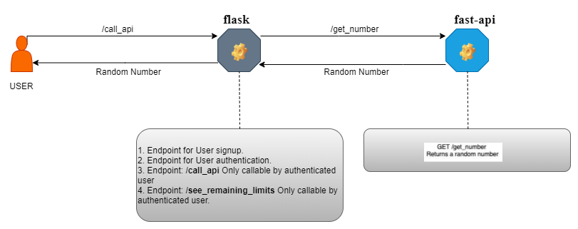
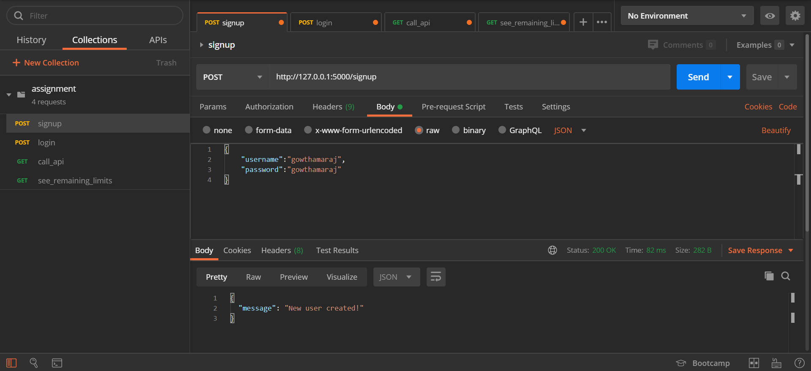
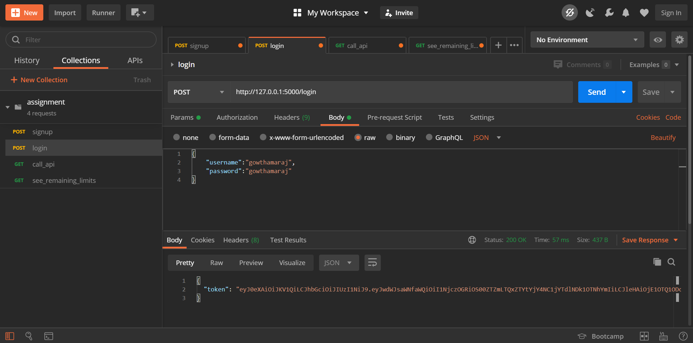
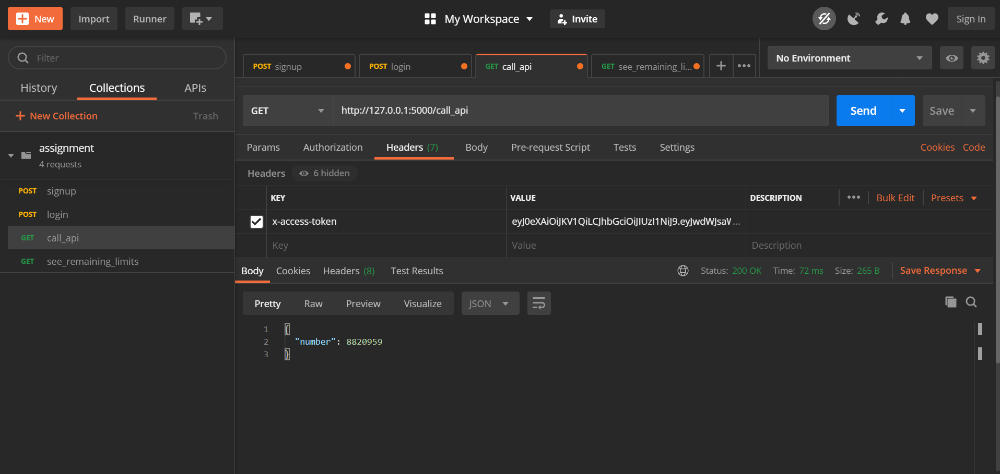
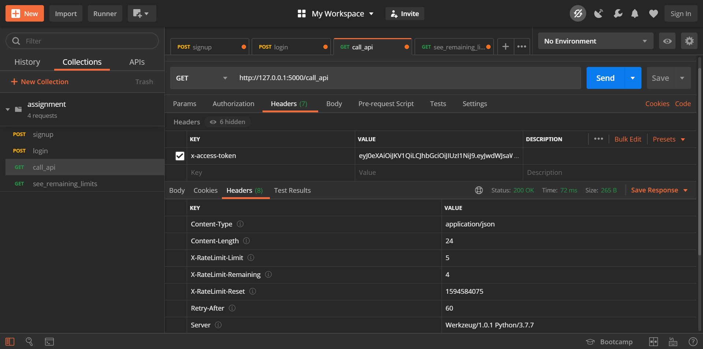
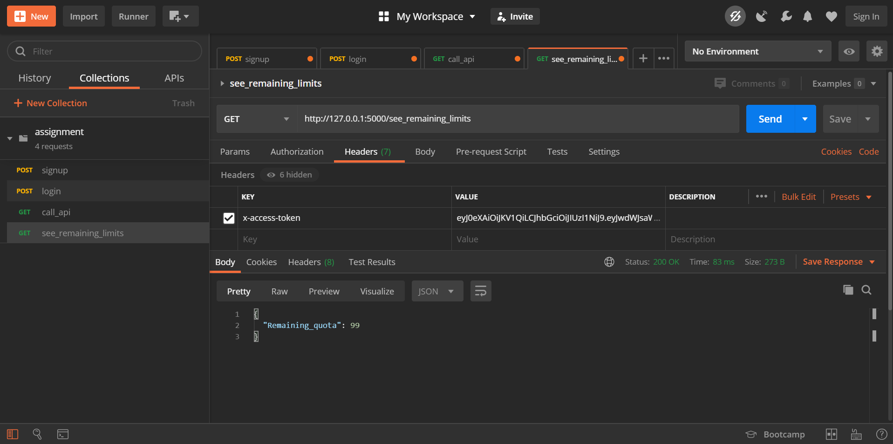
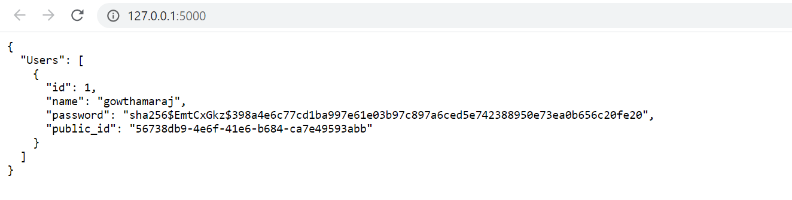

# Random Number Generator API
> Build random number generator API and add a rate limiting service on top of it.

## Tasks
The API must accomplish the following prime tasks.
 - An API running which returns a random number . (referred to as API A )
 - An service which sits between users and the above API A which allows for the following:
    1. Endpoint for User signup. (just username and password)
    2. Endpoint for User authentication.
    3. Endpoint: /call_api Only callable by authenticated user. If the user is authenticated and has not exhausted it’s rate limits, call API and return the answer back to the user. If a user is not authenticated or does not have api calls left, return 403.
    4. Endpoint: /see_remaining_limits Only callable by authenticated user. Returns how many requests are left for that user in that hour.

## Diagrammatic Representation


## Run project
Follow the steps below to run the project on your local dev environment.
```sh
    $ git clone https://github.com/gowthamaraj/random-number-generator-API.git
    $ cd random-number-generator-API
    $ pip install -r requirements.txt
    $ python main.py
    $ python fastapi_main.py
```

## API endpoints
These endpoints allow you to signup, login, call_api, and see_remaining_limits

### Interaction with Postman
1. `http://127.0.0.1:5000/signup`

2. `http://127.0.0.1:5000/login`

3. `http://127.0.0.1:5000/call_api`


4. `http://127.0.0.1:5000/see_remaining_limits`

5. `http://127.0.0.1:5000/`

